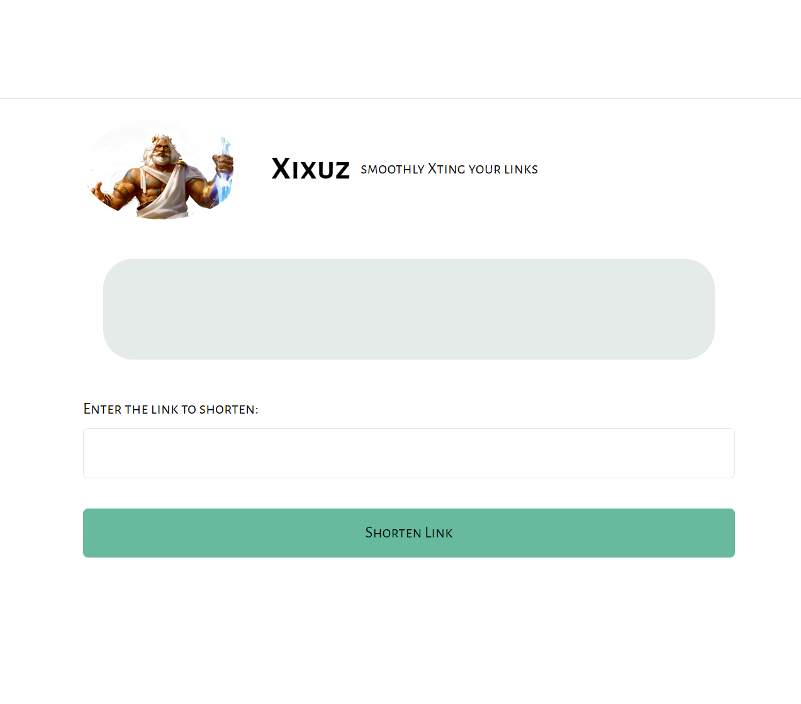
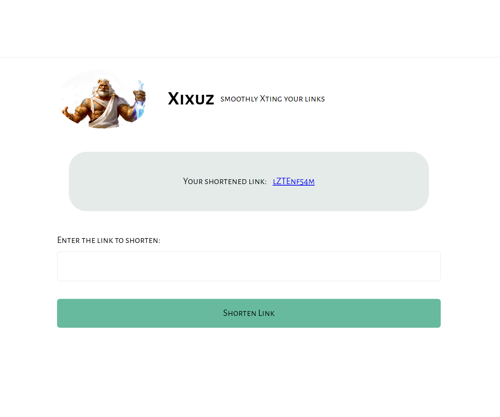

# **Scissors App**

## Introduction

This is a link shortening app, similar to bit.ly or ow.ly.

## Requirements

- URL Shortening:
  Scissors allows users to shorten URLs by pasting a long URL into the Scissors platform and a
  shorter URL gets automatically generated. The shortened URL is designed to be as short as
  possible, making it easy to share on social media or through other channels.
- Custom URLs:
  Scissors also allows users to customize their shortened URLs. Users can choose their own
  custom domain name and customize the URL to reflect their brand or content. This feature is
  particularly useful for individuals or small businesses who want to create branded links for their
- QR Code Generation:
  Scissors allows users to also generate QR codes for the shortened URLs. Users can download
  the QR code image and use it in their promotional materials or/and on their website. This
  feature will be implemented using a third-party QR code generator API, which can be integrated
  into the Scissors platform.
- Analytics:
  Scissors provides basic analytics that allow users to track their shortened URL's performance.
  Users can see how many clicks their shortened URL has received and where the clicks are
  coming from. We need to track when a URL is used.
- Link History:
  Scissors allows users to see the history of links they’ve created so they can easily find and reuse
  links they have previously created

## Setup

- Install NodeJS, mongodb
- pull this repo
- update `env` file with personal mongodb details as required, follow: [How-to-deploy-mongodb-database](https://www.freecodecamp.org/news/learn-mongodb-a4ce205e7739/)
- run `npm run start`

---

## Base URL

[scissors](https://xixuz.onrender.com/)

### Link/Limo MODEL




## handler functions (controllers)

### shortenLimo

- Route: /api/v1/shorten
- Method: POST
- Body: {
  "original_url": "[mongodb-link](https://cloud.mongodb.com/v2/)"
  }

```JavaScript
res.render('index', { data: { shortenedLimo: shortID, error: null } });
```



### getSiteFromShortenedLimo

```JavaScript
- Route: /api/v1/:shortID
- Method: GET
- Body:

 res.redirect(limo.original_url);
```

### signup

```JavaScript
- Route: /login
- Method: POST
- Body: { "email" : "example.com",
"username": "user123",
"password": "1234ghi",
- }

res.render('login', info);
```

**NOTE:** _info_ is an object containing user details to be displayed on client side

### login

```JavaScript
- Route: /login
- Method: POST
- Body: { "email" : "example.com",
- "password": "1234ghi"
- }

res.render('index', {
      data: {
        username: user.username,
        history: limos,
      },
});
```

## Contributor

- Wilson Ezeibekwe

```

```
